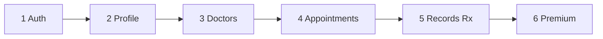
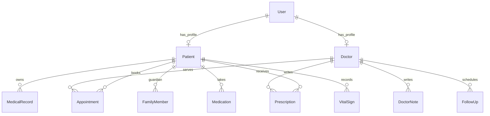

# Healthcare Platform — API Reference for Expo Mobile

**Who is this for?** Developers building the Expo/React Native mobile app. Maps every screen to exact API calls.

**Companion guide:** [BACKEND-GUIDE.md](BACKEND-GUIDE.md) (plain English, non-technical)

**Last updated:** June 2026

---

## Quick Setup

| Item | Value |
|------|-------|
| Base URL (local) | `http://localhost:8000/api/v1` |
| Health check | `GET http://localhost:8000/health` |
| Swagger UI | `http://localhost:8000/docs` |
| OpenAPI JSON | `http://localhost:8000/openapi.json` |
| Default admin | `admin@example.com` / `Admin@123456` |
| Expo CORS origin | `http://localhost:8081` (pre-configured in `backend/.env.example`) |

**Start backend:**

```bash
cd backend
python -m venv venv
source venv/bin/activate   # Windows: venv\Scripts\activate
pip install -r requirements.txt
cp .env.example .env
alembic upgrade head
uvicorn app.main:app --reload --host 0.0.0.0 --port 8000
```

Or with Docker: `docker compose up --build`

---

## Authentication Pattern for Expo

### Login flow

```typescript
// 1. Login
const res = await fetch(`${BASE_URL}/auth/login`, {
  method: 'POST',
  headers: { 'Content-Type': 'application/json' },
  body: JSON.stringify({ email, password }),
});
const { access_token, refresh_token, token_type } = await res.json();

// 2. Store securely (use expo-secure-store for tokens)
await SecureStore.setItemAsync('access_token', access_token);
await SecureStore.setItemAsync('refresh_token', refresh_token);

// 3. Attach to all protected requests
headers: { Authorization: `Bearer ${access_token}` }
```

### Token refresh on 401

```typescript
async function apiFetch(path: string, options: RequestInit = {}) {
  let token = await SecureStore.getItemAsync('access_token');
  let res = await fetch(`${BASE_URL}${path}`, {
    ...options,
    headers: { ...options.headers, Authorization: `Bearer ${token}` },
  });

  if (res.status === 401) {
    const refresh = await SecureStore.getItemAsync('refresh_token');
    const refreshRes = await fetch(`${BASE_URL}/auth/refresh`, {
      method: 'POST',
      headers: { 'Content-Type': 'application/json' },
      body: JSON.stringify({ refresh_token: refresh }),
    });
    if (!refreshRes.ok) throw new Error('Session expired');
    const tokens = await refreshRes.json();
    await SecureStore.setItemAsync('access_token', tokens.access_token);
    await SecureStore.setItemAsync('refresh_token', tokens.refresh_token);
    token = tokens.access_token;
    res = await fetch(`${BASE_URL}${path}`, {
      ...options,
      headers: { ...options.headers, Authorization: `Bearer ${token}` },
    });
  }
  return res;
}
```

### Logout

```typescript
await fetch(`${BASE_URL}/auth/logout`, {
  method: 'POST',
  headers: { 'Content-Type': 'application/json' },
  body: JSON.stringify({ refresh_token }),
});
// Clear stored tokens
```

### Token lifetimes

| Token | Lifetime | Purpose |
|-------|----------|---------|
| Access token | 30 minutes | Sent on every API call |
| Refresh token | 7 days | Get new access token; rotated on each refresh |

### Role in JWT

The access token payload includes `role`: `patient`, `doctor`, or `admin`. Use this client-side for navigation (which tab stack to show). **Always trust server-side 403** for authorization — never rely on client role alone.

### Doctor login requirement

Doctors with `is_approved: false` cannot log in until admin approves via `POST /admin/doctors/{user_id}/approve`.

---

## Error Codes

| Code | Meaning | Expo handling |
|------|---------|---------------|
| **401** | Not logged in or token expired | Refresh token or redirect to login |
| **403** | Wrong role or no access to resource | Show "not allowed" message |
| **404** | Resource not found | Show empty state or error |
| **409** | Conflict (e.g., slot already booked) | Show "slot taken, pick another" |
| **422** | Validation error | Show field errors from `detail` array |

Error body shape (FastAPI default):

```json
{ "detail": "Human-readable message" }
```

Or for validation:

```json
{ "detail": [{ "loc": ["body", "email"], "msg": "...", "type": "..." }] }
```

---

## Role Access Matrix

| Role | Public endpoints | Patient | Doctor | Admin |
|------|------------------|---------|--------|-------|
| Browse doctors | Yes | Yes | Yes | Yes |
| View slots | Yes | Yes | Yes | Yes |
| Book appointment | — | Yes | — | — |
| Confirm/complete appointment | — | — | Yes | Yes |
| Upload medical records | — | Yes | Yes | Yes |
| Create prescription | — | — | Yes | — |
| Doctor notes (write) | — | — | Yes | — |
| Family management | — | Yes | — | — |
| Admin portal | — | — | — | Yes |

**Doctor → patient data rule:** Doctors can only access patients they share appointment history with (`clinical_access.py`).

**Private doctor notes:** Patients cannot see notes where `is_private: true`.

---

## Screen → API Mapping

### Patient App

| Screen | APIs | Notes |
|--------|------|-------|
| **Login** | `POST /auth/login` | Store tokens on success |
| **Registration** | `POST /auth/register/patient` | Then login |
| **Forgot password** | `POST /auth/password-reset/request`, `POST /auth/password-reset/confirm` | Dev mode returns token in response |
| **Dashboard** | `GET /appointments/upcoming`, `GET /notifications/me`, `GET /medications/reminders/due` | Combine for home widgets |
| **Doctor Listing** | `GET /doctors?search=&specialization=&page=&page_size=` | **Public — no auth** |
| **Doctor Details** | `GET /doctors/{id}`, `GET /appointments/doctors/{id}/slots?appointment_date=` | Slots need date `YYYY-MM-DD` |
| **Appointment Booking** | `POST /appointments` | Optional `family_member_id` |
| **Appointments — Upcoming** | `GET /appointments/upcoming?page=&page_size=` | |
| **Appointments — Completed** | `GET /appointments/completed` | |
| **Appointments — History** | `GET /appointments/history?status=&from_date=&to_date=` | |
| **Appointment Detail** | `GET /appointments/{id}`, `POST /appointments/{id}/cancel`, `POST /appointments/{id}/reschedule` | |
| **Medical Records List** | `GET /medical-records?record_type=&page=` | Patient sees own records |
| **Medical Records Upload** | `POST /medical-records` (multipart) | See file upload section |
| **Medical Records Download** | `GET /medical-records/{id}/download` | Returns file binary |
| **Prescriptions List** | `GET /prescriptions?page=` | |
| **Prescription Detail** | `GET /prescriptions/{id}`, `GET /prescriptions/{id}/download` | |
| **Profile — Basic** | `GET /users/me`, `PUT /users/me` | Name, phone, photo, language |
| **Profile — Patient** | `GET /patients/me`, `PUT /patients/me` | DOB, gender, blood group |
| **Profile — Medical** | `PUT /patients/me/medical` | Allergies, history, conditions |
| **Family Members** | `GET /family/members`, `POST /family/members`, `PUT /family/members/{id}`, `DELETE /family/members/{id}` | |
| **Family Dashboard** | `GET /family/dashboard` | Summary of all members |
| **Emergency Profile** | `GET /family/emergency/me`, `PUT /family/emergency/me` | |
| **Emergency Card** | `GET /family/emergency/card?family_member_id=` | One-tap critical info |
| **Health Timeline** | `GET /health-timeline?event_type=&from_date=&to_date=` | |
| **Digital Locker** | `GET /digital-locker/summary`, `GET /digital-locker` | |
| **Locker Access Logs** | `GET /digital-locker/access-logs`, `GET /digital-locker/downloads` | |
| **Family Shared Records** | `GET /digital-locker/family-shared` | |
| **Medications List** | `GET /medications?active_only=true` | |
| **Add Medication** | `POST /medications` | Include `schedules[]` |
| **Log Dose** | `POST /medications/{id}/log` | Status: `taken`, `missed`, `skipped` |
| **Medication History** | `GET /medications/logs` | |
| **Due Reminders** | `GET /medications/reminders/due` | |
| **Vitals Log** | `POST /vitals`, `GET /vitals` | |
| **Vitals Trends** | `GET /vitals/trends?vital_type=&days=30` | Chart data |
| **Waitlist** | `POST /appointments/waitlist`, `GET /appointments/waitlist`, `DELETE /appointments/waitlist/{id}` | |
| **Recurring Booking** | `POST /appointments/recurring`, `GET /appointments/recurring`, `DELETE /appointments/recurring/{id}` | |
| **Quick Rebook** | `POST /appointments/{id}/quick-rebook` | Same doctor, next slot |
| **Notifications** | `GET /notifications/me?page=` | List only — no push yet |

### Doctor App

| Screen | APIs | Notes |
|--------|------|-------|
| **Login** | `POST /auth/login` | Must have `is_approved: true` |
| **Registration** | `POST /auth/register/doctor` | Pending until admin approves |
| **Dashboard** | `GET /appointments/today`, `GET /doctors/me/analytics?days=30` | |
| **Today's Appointments** | `GET /appointments/today` | Doctor only |
| **Appointment List** | `GET /appointments/upcoming`, `GET /appointments/history` | |
| **Appointment Detail** | `GET /appointments/{id}`, `POST /appointments/{id}/confirm`, `POST /appointments/{id}/complete`, `POST /appointments/{id}/cancel`, `POST /appointments/{id}/reschedule` | |
| **Patient List** | `GET /patients?search=&page=` | Doctor + Admin only |
| **Patient Detail** | `GET /patients/{id}`, `GET /doctors/me/patients/{id}/history` | History requires prior appointments |
| **Prescription Create** | `POST /prescriptions` | Draft status initially |
| **Prescription Edit** | `PUT /prescriptions/{id}` | |
| **Prescription Share** | `POST /prescriptions/{id}/share` | Makes visible to patient |
| **Prescription Upload PDF** | `POST /prescriptions/{id}/upload` (multipart) | |
| **Doctor Notes** | `GET /doctor-notes`, `POST /doctor-notes`, `PUT /doctor-notes/{id}`, `DELETE /doctor-notes/{id}` | |
| **Follow-Ups** | `GET /follow-ups`, `POST /follow-ups`, `PUT /follow-ups/{id}` | |
| **Availability** | `GET /doctors/me/availability`, `PUT /doctors/me/availability` | Weekly schedule bulk update |
| **Leave Management** | `GET /doctors/me/leaves`, `POST /doctors/me/leaves`, `DELETE /doctors/me/leaves/{id}` | |
| **Scheduling Settings** | `GET /doctors/me/scheduling`, `PUT /doctors/me/scheduling` | Buffer + max per day |
| **Profile** | `GET /doctors/me`, `PUT /doctors/me` | Qualification, fee, etc. |
| **Analytics** | `GET /doctors/me/analytics?days=7` | 7–90 days |
| **Upload Record for Patient** | `POST /medical-records` | Set `patient_id` to patient's id |
| **Health Timeline (patient)** | `GET /health-timeline?patient_id=` | Doctor must have access |
| **Waitlist (doctor view)** | `GET /appointments/waitlist` | |

---

## Recommended Build Order



1. Auth — login, register, token storage, refresh interceptor
2. Profile — `users/me`, `patients/me`, medical info
3. Doctors — listing (public), detail, slots
4. Appointments — book, list, cancel, reschedule, doctor confirm/complete
5. Records + prescriptions + notifications
6. Premium — family, timeline, locker, medications, vitals, waitlist, recurring

---

## Full Endpoint Catalog

All paths are relative to `/api/v1`. Schema names refer to `backend/app/schemas/`.

### Health (outside `/api/v1`)

| Method | Path | Auth | Description |
|--------|------|------|-------------|
| GET | `/health` | Public | `{ status, version }` |

### Authentication — `schemas/auth.py`

| Method | Path | Auth | Schema | Description |
|--------|------|------|--------|-------------|
| POST | `/auth/register/patient` | Public | `UserRegisterRequest` → `UserResponse` | Create patient account |
| POST | `/auth/register/doctor` | Public | `UserRegisterRequest` → `UserResponse` | Create doctor (pending approval) |
| POST | `/auth/admin/users` | Admin | `AdminUserCreateRequest` → `UserResponse` | Admin creates any role |
| POST | `/auth/login` | Public | `LoginRequest` → `TokenResponse` | Get access + refresh tokens |
| POST | `/auth/logout` | Public | `RefreshTokenRequest` → `MessageResponse` | Revoke refresh token |
| POST | `/auth/refresh` | Public | `RefreshTokenRequest` → `TokenResponse` | Rotate tokens |
| POST | `/auth/password-reset/request` | Public | `PasswordResetRequest` | Request reset |
| POST | `/auth/password-reset/confirm` | Public | `PasswordResetConfirmRequest` | Set new password |

### Users — `schemas/auth.py`

| Method | Path | Auth | Schema | Description |
|--------|------|------|--------|-------------|
| GET | `/users/me` | Any | → `UserResponse` | Current user profile |
| PUT | `/users/me` | Any | `UserProfileUpdateRequest` → `UserResponse` | Update name, phone, photo, language |

### Patients — `schemas/patient.py`

| Method | Path | Auth | Schema | Description |
|--------|------|------|--------|-------------|
| GET | `/patients/me` | Patient | → `PatientResponse` | Own patient profile |
| PUT | `/patients/me` | Patient | `PatientProfileUpdateRequest` → `PatientResponse` | Update demographics |
| PUT | `/patients/me/medical` | Patient | `PatientMedicalInfoUpdateRequest` → `PatientResponse` | Allergies, history |
| GET | `/patients` | Doctor, Admin | Query: `search`, `gender`, `blood_group`, `page` | Search patients |
| GET | `/patients/{patient_id}` | Doctor, Admin | → `PatientResponse` | Patient detail |

### Doctors — `schemas/doctor.py`

| Method | Path | Auth | Schema | Description |
|--------|------|------|--------|-------------|
| GET | `/doctors` | **Public** | Query: `search`, `specialization`, `page` → `DoctorListResponse` | List doctors |
| GET | `/doctors/{doctor_id}` | **Public** | → `DoctorResponse` | Doctor detail |
| GET | `/doctors/me` | Doctor | → `DoctorResponse` | Own doctor profile |
| PUT | `/doctors/me` | Doctor | `DoctorProfileUpdateRequest` → `DoctorResponse` | Update profile |
| GET | `/doctors/me/availability` | Doctor | → `list[AvailabilitySlotResponse]` | Weekly schedule |
| PUT | `/doctors/me/availability` | Doctor | `AvailabilityBulkUpdateRequest` → slots | Replace schedule |
| GET | `/doctors/me/leaves` | Doctor | → `list[DoctorLeaveResponse]` | List leave days |
| POST | `/doctors/me/leaves` | Doctor | `DoctorLeaveCreateRequest` → `DoctorLeaveResponse` | Add leave |
| DELETE | `/doctors/me/leaves/{leave_id}` | Doctor | → `MessageResponse` | Remove leave |

### Admin — Doctor Approval

| Method | Path | Auth | Schema | Description |
|--------|------|------|--------|-------------|
| GET | `/admin/doctors/pending` | Admin | → `list[PendingDoctorResponse]` | Pending registrations |
| POST | `/admin/doctors/{user_id}/approve` | Admin | → `DoctorApprovalActionResponse` | Approve doctor |
| POST | `/admin/doctors/{user_id}/reject` | Admin | → `DoctorApprovalActionResponse` | Reject doctor |

### Doctor Analytics — `schemas/clinical.py`

| Method | Path | Auth | Schema | Description |
|--------|------|------|--------|-------------|
| GET | `/doctors/me/analytics` | Doctor | Query: `days` (7–90) → `DoctorAnalyticsResponse` | Performance stats |
| GET | `/doctors/me/patients/{patient_id}/history` | Doctor | → `PatientHistoryResponse` | Full patient history |

### Appointments — `schemas/appointment.py`

| Method | Path | Auth | Schema | Description |
|--------|------|------|--------|-------------|
| GET | `/appointments/doctors/{doctor_id}/slots` | **Public** | Query: `appointment_date` → `AvailableSlotsResponse` | 30-min slots |
| POST | `/appointments` | Patient | `AppointmentBookRequest` → `AppointmentResponse` | Book (optional `family_member_id`) |
| GET | `/appointments/upcoming` | Patient, Doctor, Admin | → `AppointmentListResponse` | Future appointments |
| GET | `/appointments/completed` | Patient, Doctor, Admin | → `AppointmentListResponse` | Completed only |
| GET | `/appointments/history` | Patient, Doctor, Admin | Query: `status`, `from_date`, `to_date`, `doctor_id`, `patient_id` | Filtered history |
| GET | `/appointments/today` | Doctor | → `AppointmentListResponse` | Today's schedule |
| GET | `/appointments/{appointment_id}` | Patient, Doctor, Admin | → `AppointmentResponse` | Single appointment |
| POST | `/appointments/{appointment_id}/confirm` | Doctor, Admin | → `AppointmentResponse` | Confirm pending |
| POST | `/appointments/{appointment_id}/reschedule` | Patient, Doctor, Admin | `AppointmentRescheduleRequest` | New date/time |
| POST | `/appointments/{appointment_id}/cancel` | Patient, Doctor, Admin | `AppointmentCancelRequest` | Cancel |
| POST | `/appointments/{appointment_id}/complete` | Doctor, Admin | `AppointmentCompleteRequest` | Mark done |

**Appointment statuses:** `pending`, `confirmed`, `completed`, `cancelled`

### Advanced Scheduling — `schemas/scheduling.py`

| Method | Path | Auth | Schema | Description |
|--------|------|------|--------|-------------|
| GET | `/doctors/me/scheduling` | Doctor | → `DoctorSchedulingSettingsResponse` | Buffer + max/day |
| PUT | `/doctors/me/scheduling` | Doctor | `DoctorSchedulingSettingsRequest` | Update settings |
| POST | `/appointments/waitlist` | Patient | `WaitlistJoinRequest` → `WaitlistEntryResponse` | Join waitlist |
| GET | `/appointments/waitlist` | Patient, Doctor, Admin | → `list[WaitlistEntryResponse]` | List entries |
| DELETE | `/appointments/waitlist/{waitlist_id}` | Patient | 204 | Leave waitlist |
| POST | `/appointments/recurring` | Patient | `RecurringAppointmentCreateRequest` → `RecurringAppointmentResponse` | Create series |
| GET | `/appointments/recurring` | Patient, Doctor, Admin | → `list[RecurringAppointmentResponse]` | List series |
| DELETE | `/appointments/recurring/{series_id}` | Patient | → `RecurringAppointmentResponse` | Deactivate |
| POST | `/appointments/recurring/{series_id}/generate` | Patient | Query: `count` → `{ appointments_created }` | Generate more |
| POST | `/appointments/{appointment_id}/quick-rebook` | Patient | → `QuickRebookResponse` | Rebook same doctor |

**Recurrence patterns:** `weekly`, `biweekly`, `monthly`  
**Waitlist:** FIFO auto-offer on cancellation

### Medical Records (EHR) — `schemas/medical.py`

| Method | Path | Auth | Schema | Description |
|--------|------|------|--------|-------------|
| POST | `/medical-records` | Patient, Doctor, Admin | Multipart form → `MedicalRecordResponse` | Upload file |
| GET | `/medical-records` | Patient, Doctor, Admin | Query: `patient_id`, `record_type`, `page` | List records |
| GET | `/medical-records/{record_id}` | Patient, Doctor, Admin | → `MedicalRecordResponse` | Metadata (logs access) |
| GET | `/medical-records/{record_id}/download` | Patient, Doctor, Admin | File binary | Download (logs download) |
| DELETE | `/medical-records/{record_id}` | Patient, Doctor, Admin | 204 | Delete record |
| GET | `/medical-records/files/{storage_key}` | Patient, Doctor, Admin | File binary | Dev local serve (hidden) |

**Record types:** `prescription`, `diagnostic_report`, `lab_report`, `xray`, `mri`, `ctscan`  
**Max file size:** 10 MB (configurable via `MAX_UPLOAD_SIZE_MB`)

### Prescriptions — `schemas/medical.py`

| Method | Path | Auth | Schema | Description |
|--------|------|------|--------|-------------|
| POST | `/prescriptions` | Doctor | `PrescriptionCreateRequest` → `PrescriptionResponse` | Create draft |
| GET | `/prescriptions` | Patient, Doctor, Admin | Query: `patient_id`, `page` | List |
| GET | `/prescriptions/{prescription_id}` | Patient, Doctor, Admin | → `PrescriptionResponse` | Detail |
| PUT | `/prescriptions/{prescription_id}` | Doctor | `PrescriptionUpdateRequest` | Edit draft |
| POST | `/prescriptions/{prescription_id}/share` | Doctor | → `PrescriptionResponse` | Share with patient |
| POST | `/prescriptions/{prescription_id}/upload` | Doctor | Multipart `file` | Attach PDF |
| GET | `/prescriptions/{prescription_id}/download` | Patient, Doctor, Admin | File binary | Download PDF |

**Prescription statuses:** `draft`, `shared`

### Notifications — `schemas/medical.py`

| Method | Path | Auth | Schema | Description |
|--------|------|------|--------|-------------|
| GET | `/notifications/me` | Patient, Doctor, Admin | Query: `page` → `NotificationListResponse` | In-app list |

### Admin Portal — `schemas/medical.py`, `schemas/auth.py`

| Method | Path | Auth | Schema | Description |
|--------|------|------|--------|-------------|
| GET | `/admin/analytics` | Admin | → `AnalyticsResponse` | Dashboard totals |
| GET | `/admin/users` | Admin | Query: `role`, `search`, `page` → `list[UserResponse]` | All users |
| PUT | `/admin/users/{user_id}` | Admin | `AdminUserUpdateRequest` → `UserResponse` | Update user |
| GET | `/admin/appointments` | Admin | Query: `status`, `page` | Monitor appointments |
| GET | `/admin/medical-records` | Admin | Query: `record_type`, `page` | Monitor records |
| GET | `/admin/audit-logs` | Admin | Query: `action`, `resource`, `page` | Audit trail |
| GET | `/admin/usage-reports` | Admin | Query: `days` → `UsageReportResponse` | Usage over time |

### Family Health — `schemas/family.py`

| Method | Path | Auth | Schema | Description |
|--------|------|------|--------|-------------|
| GET | `/family/members` | Patient | → `list[FamilyMemberResponse]` | List members |
| POST | `/family/members` | Patient | `FamilyMemberCreateRequest` → `FamilyMemberResponse` | Add member |
| GET | `/family/members/{family_member_id}` | Patient | → `FamilyMemberResponse` | Member detail |
| PUT | `/family/members/{family_member_id}` | Patient | `FamilyMemberUpdateRequest` | Update member |
| DELETE | `/family/members/{family_member_id}` | Patient | → `MessageResponse` | Remove member |
| GET | `/family/dashboard` | Patient | → `FamilyDashboardResponse` | Family overview |
| GET | `/family/emergency/me` | Patient | → `EmergencyProfileResponse` | Own emergency profile |
| PUT | `/family/emergency/me` | Patient | `EmergencyProfileUpdateRequest` | Update emergency info |
| GET | `/family/emergency/card` | Patient | Query: `family_member_id?` → `EmergencyCardResponse` | One-tap card |
| PUT | `/family/emergency/members/{family_member_id}` | Patient | `EmergencyProfileUpdateRequest` | Member emergency |

**Relationships:** `parent`, `child`, `spouse`, `sibling`, `other`

### Health Timeline — `schemas/timeline.py`

| Method | Path | Auth | Schema | Description |
|--------|------|------|--------|-------------|
| GET | `/health-timeline` | Patient, Doctor, Admin | Query: `patient_id`, `event_type`, `from_date`, `to_date`, `page` → `TimelineListResponse` | Chronological events |
| POST | `/health-timeline/sync` | Doctor, Admin | Query: `patient_id` → `{ patient_id, events_cached }` | Rebuild cache |

### Digital Health Locker — `schemas/timeline.py`

| Method | Path | Auth | Schema | Description |
|--------|------|------|--------|-------------|
| GET | `/digital-locker/summary` | Patient, Doctor, Admin | Query: `patient_id?` → `DigitalLockerSummaryResponse` | Counts by type |
| GET | `/digital-locker` | Patient, Doctor, Admin | Query: `patient_id?` → `DigitalLockerListResponse` | Locker overview |
| GET | `/digital-locker/downloads` | Patient, Doctor, Admin | Query: `patient_id?`, `page` | Download history |
| GET | `/digital-locker/access-logs` | Patient, Doctor, Admin | Query: `patient_id?`, `page` | View audit trail |
| GET | `/digital-locker/family-shared` | Patient | → `list[dict]` | Family-shared records |

### Medications — `schemas/medication.py`

| Method | Path | Auth | Schema | Description |
|--------|------|------|--------|-------------|
| GET | `/medications` | Patient, Doctor, Admin | Query: `patient_id?`, `active_only` | List medications |
| POST | `/medications` | Patient, Doctor, Admin | `MedicationCreateRequest` → `MedicationResponse` | Add medication |
| PUT | `/medications/{medication_id}` | Patient, Doctor, Admin | `MedicationUpdateRequest` | Update |
| POST | `/medications/{medication_id}/log` | Patient, Doctor, Admin | `MedicationLogRequest` → `MedicationLogResponse` | Log dose |
| GET | `/medications/logs` | Patient, Doctor, Admin | Query: filters, `page` | Dose history |
| GET | `/medications/reminders/due` | Patient, Doctor, Admin | Query: `patient_id?` | Due today |
| POST | `/medications/reminders/send` | Patient, Admin | Query: `patient_id?` → `{ notifications_sent }` | Trigger reminders |

**Log statuses:** `taken`, `missed`, `skipped`

### Vitals — `schemas/medication.py`

| Method | Path | Auth | Schema | Description |
|--------|------|------|--------|-------------|
| POST | `/vitals` | Patient, Doctor, Admin | `VitalSignCreateRequest` → `VitalSignResponse` | Log vital |
| GET | `/vitals` | Patient, Doctor, Admin | Query: `patient_id?`, `vital_type?`, `from_date?`, `page` | List vitals |
| GET | `/vitals/trends` | Patient, Doctor, Admin | Query: `vital_type` (required), `patient_id?`, `days` → `VitalTrendsResponse` | Chart data |

**Vital types:** `blood_pressure`, `blood_sugar`, `weight`, `heart_rate`, `oxygen`

### Doctor Notes — `schemas/clinical.py`

| Method | Path | Auth | Schema | Description |
|--------|------|------|--------|-------------|
| GET | `/doctor-notes` | Doctor, Patient, Admin | Query: `patient_id?`, `appointment_id?`, `note_type?`, `page` | List (private hidden from patients) |
| POST | `/doctor-notes` | Doctor | `DoctorNoteCreateRequest` → `DoctorNoteResponse` | Create note |
| GET | `/doctor-notes/{note_id}` | Doctor, Patient, Admin | → `DoctorNoteResponse` | Get note |
| PUT | `/doctor-notes/{note_id}` | Doctor | `DoctorNoteUpdateRequest` | Update |
| DELETE | `/doctor-notes/{note_id}` | Doctor | 204 | Delete |

**Note types:** `consultation`, `diagnosis`, `follow_up`, `private`, `observation`

### Follow-Ups — `schemas/clinical.py`

| Method | Path | Auth | Schema | Description |
|--------|------|------|--------|-------------|
| GET | `/follow-ups` | Doctor, Patient, Admin | Query: `patient_id?`, `status?`, `page` | List |
| POST | `/follow-ups` | Doctor | `FollowUpCreateRequest` → `FollowUpResponse` | Schedule |
| PUT | `/follow-ups/{follow_up_id}` | Doctor | `FollowUpUpdateRequest` | Update |
| POST | `/follow-ups/reminders/send` | Admin | → `{ notifications_sent }` | Cron/admin trigger |

---

## Example Request Bodies

### Register patient

```json
POST /api/v1/auth/register/patient
{
  "email": "patient@example.com",
  "password": "SecurePass1",
  "full_name": "Jane Doe",
  "phone": "+919876543210",
  "language_preference": "en"
}
```

### Login

```json
POST /api/v1/auth/login
{
  "email": "patient@example.com",
  "password": "SecurePass1"
}

// Response
{
  "access_token": "eyJ...",
  "refresh_token": "abc...",
  "token_type": "bearer"
}
```

### Book appointment

```json
POST /api/v1/appointments
Authorization: Bearer <access_token>

{
  "doctor_id": 1,
  "appointment_date": "2026-06-15",
  "start_time": "10:00:00",
  "reason": "Annual checkup",
  "family_member_id": null
}
```

### Upload medical record (multipart)

```typescript
const formData = new FormData();
formData.append('patient_id', '1');
formData.append('record_type', 'lab_report');
formData.append('title', 'Blood Test Results');
formData.append('description', 'June 2026');
formData.append('file', {
  uri: fileUri,
  name: 'report.pdf',
  type: 'application/pdf',
} as any);

await fetch(`${BASE_URL}/medical-records`, {
  method: 'POST',
  headers: { Authorization: `Bearer ${token}` },
  body: formData,
});
```

### Create prescription (doctor)

```json
POST /api/v1/prescriptions
{
  "patient_id": 1,
  "appointment_id": 5,
  "diagnosis": "Seasonal allergy",
  "medications": [
    { "name": "Cetirizine", "dosage": "10mg", "frequency": "Once daily", "duration": "7 days" }
  ],
  "instructions": "Take after meals"
}
```

### Add family member

```json
POST /api/v1/family/members
{
  "full_name": "Rahul Doe",
  "relationship": "child",
  "date_of_birth": "2015-03-10",
  "gender": "male",
  "blood_group": "B+",
  "allergies": "Peanuts",
  "can_share_records": true
}
```

### Add medication with schedule

```json
POST /api/v1/medications
{
  "name": "Metformin",
  "dosage": "500mg",
  "frequency": "Twice daily",
  "instructions": "With food",
  "schedules": [
    { "time_of_day": "08:00:00", "days_of_week": "0,1,2,3,4,5,6", "reminder_enabled": true },
    { "time_of_day": "20:00:00", "days_of_week": "0,1,2,3,4,5,6", "reminder_enabled": true }
  ]
}
```

### Log vital sign

```json
POST /api/v1/vitals
{
  "vital_type": "blood_pressure",
  "value": 120.0,
  "secondary_value": 80.0,
  "unit": "mmHg",
  "notes": "Morning reading"
}
```

### Join waitlist

```json
POST /api/v1/appointments/waitlist
{
  "doctor_id": 1,
  "desired_date": "2026-06-20",
  "preferred_start_time": "10:00:00",
  "reason": "Follow-up visit"
}
```

### Create recurring appointment

```json
POST /api/v1/appointments/recurring
{
  "doctor_id": 1,
  "recurrence_pattern": "weekly",
  "day_of_week": 2,
  "preferred_start_time": "10:00:00",
  "start_date": "2026-06-10",
  "weeks_ahead": 4,
  "reason": "Weekly physiotherapy"
}
```

### Doctor note

```json
POST /api/v1/doctor-notes
{
  "patient_id": 1,
  "appointment_id": 5,
  "note_type": "consultation",
  "title": "Initial consultation",
  "content": "Patient reports mild headache for 3 days...",
  "is_private": false
}
```

### Set doctor availability

```json
PUT /api/v1/doctors/me/availability
{
  "slots": [
    { "day_of_week": 0, "start_time": "09:00:00", "end_time": "17:00:00", "is_active": true },
    { "day_of_week": 1, "start_time": "09:00:00", "end_time": "17:00:00", "is_active": true }
  ]
}
```

`day_of_week`: 0 = Monday, 6 = Sunday

---

## File Uploads

### Medical records

| Field | Type | Required | Notes |
|-------|------|----------|-------|
| `patient_id` | int | Yes | Target patient |
| `record_type` | string | Yes | See record types above |
| `title` | string | Yes | Display name |
| `description` | string | No | Optional notes |
| `appointment_id` | int | No | Link to visit |
| `file` | file | Yes | PDF, JPG, PNG, DOCX; max 10 MB |

### Prescription PDF

| Field | Type | Required |
|-------|------|----------|
| `file` | file | Yes |

Use `multipart/form-data`. Do **not** set `Content-Type: application/json` for uploads.

---

## Data Models Overview



| Entity | Key fields | Model file |
|--------|------------|------------|
| User | email, role, is_active, is_approved | `models/user.py` |
| Patient | DOB, gender, blood_group, allergies | `models/patient.py` |
| Doctor | specialization, fee, is_approved | `models/patient.py` |
| Appointment | date, time, status, patient_id, doctor_id | `models/appointment.py` |
| MedicalRecord | record_type, file, storage_key | `models/medical.py` |
| Prescription | medications JSON, status draft/shared | `models/medical.py` |
| FamilyMember | relationship, guardian, dependent patient | `models/family.py` |
| Medication | schedules, logs | `models/medication.py` |
| VitalSign | vital_type, value | `models/medication.py` |
| DoctorNote | note_type, is_private | `models/clinical.py` |
| FollowUp | scheduled_date, status | `models/clinical.py` |
| HealthTimelineEvent | event_type, cached data | `models/timeline.py` |
| RecurringAppointment | pattern, day_of_week | `models/scheduling.py` |
| AppointmentWaitlist | desired_date, status | `models/scheduling.py` |

---

## Pagination

Most list endpoints accept:

| Query param | Default | Max |
|-------------|---------|-----|
| `page` | 1 | — |
| `page_size` | 20 | 100 |

Response shape:

```json
{
  "items": [...],
  "total": 42,
  "page": 1,
  "page_size": 20
}
```

---

## Not Implemented — Do Not Build Mobile UI Yet

| Feature | Sprint | Status |
|---------|--------|--------|
| Video consultation | 16 | No endpoints |
| In-call chat / file share | 16 | No endpoints |
| Live appointment queue | 16 | No endpoints |
| Push notifications (FCM/APNs) | 17 | No endpoints |
| Notification preferences | 17 | No endpoints |
| SMS notifications | 17 | No endpoints |
| Record tags | 18 | No endpoints |
| Advanced record search | 18 | No endpoints |
| Multi-clinic / branches | 18 | No endpoints |
| Medical ID PDF/QR export | 11 | API card exists; export not built |
| Phase 2 AI features | 19–24 | Planned |

---

## Expo Project Structure (Suggested)

Based on `doc/plan.md`:

```
mobile/
├── src/
│   ├── api/
│   │   ├── client.ts          # fetch wrapper with auth refresh
│   │   ├── auth.ts            # login, register, logout
│   │   ├── appointments.ts    # React Query hooks
│   │   ├── doctors.ts
│   │   ├── records.ts
│   │   └── ...
│   ├── screens/
│   │   ├── patient/
│   │   └── doctor/
│   ├── store/                 # Redux Toolkit (auth, settings)
│   └── navigation/
```

**State management:**
- **Redux Toolkit** — auth state, user profile, app settings
- **React Query** — server data (appointments, records, doctors) with caching

---

## Key Backend Source Files

| Purpose | Path |
|---------|------|
| Route registration | `backend/app/api/v1/router.py` |
| Auth endpoints | `backend/app/api/v1/endpoints/auth.py` |
| Appointment logic | `backend/app/services/appointment_service.py` |
| Access control | `backend/app/core/deps.py`, `backend/app/services/clinical_access.py` |
| File storage | `backend/app/core/storage.py` |
| All schemas | `backend/app/schemas/` |
| Integration tests | `backend/tests/` |

---

## Related Docs

| Doc | Purpose |
|-----|---------|
| [BACKEND-GUIDE.md](BACKEND-GUIDE.md) | Plain English product guide |
| [backend/README.md](backend/README.md) | Backend setup and module status |
| [doc/features.md](doc/features.md) | Full product requirements |
| [doc/todo list.md](doc/todo%20list.md) | Sprint checklist with completion status |
