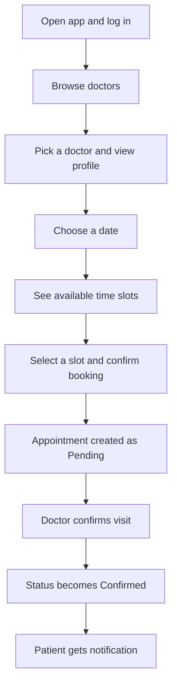
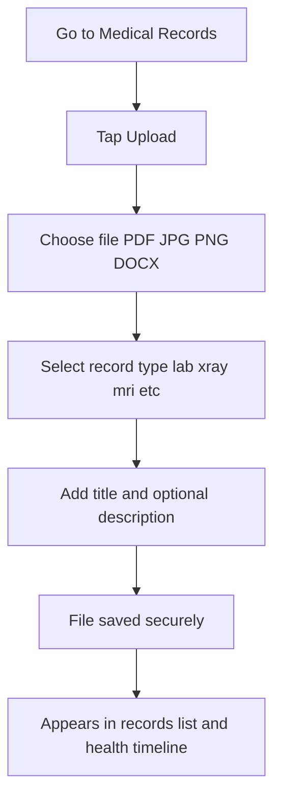
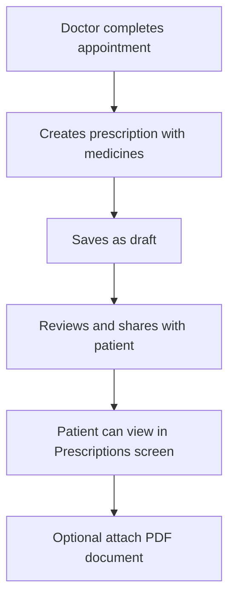
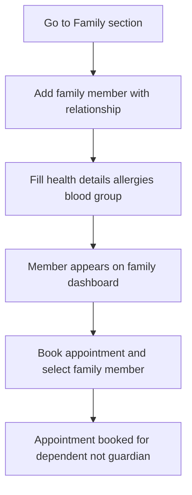
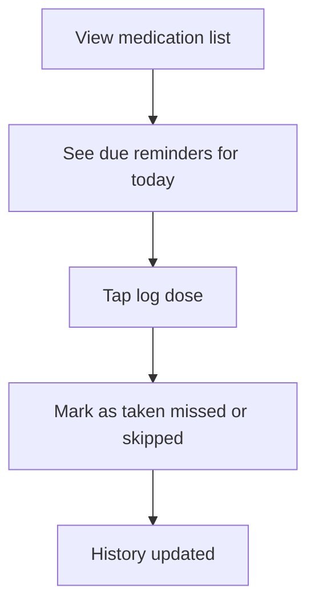
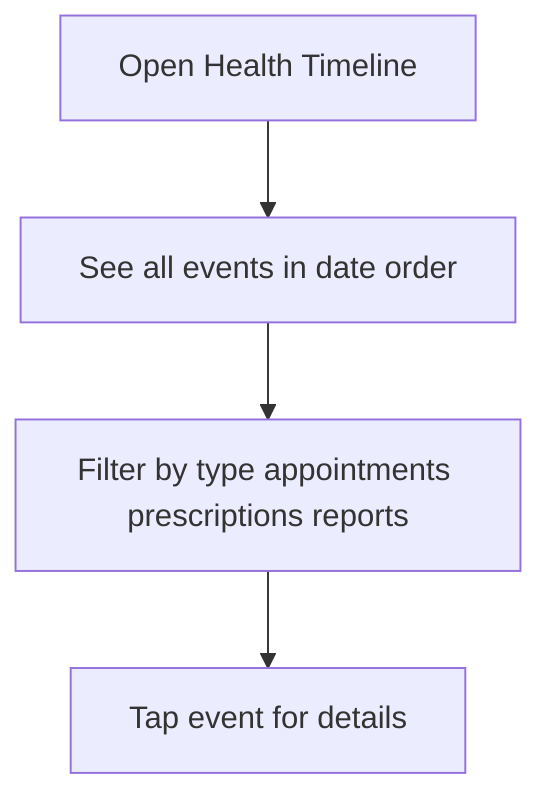

# Healthcare Platform — Plain English Guide

**Who is this for?** Anyone who wants to understand what the app does and how it works — designers, product managers, non-technical teammates, and you when planning Expo mobile screens.

**Last updated:** June 2026  
**Source of truth:** The backend code is fully built for core features (Sprints 1–7) and premium features (Sprints 11–15). Some older planning docs in `doc/` still say premium features are "planned" — that is outdated.

---

## What Is This App?

This is a **healthcare platform** that connects three types of people:

- **Patients** — book doctor visits, store medical reports, track medications, manage family health
- **Doctors** — manage their schedule, see patients, write prescriptions and clinical notes
- **Admins** — approve new doctors, monitor the system, view usage reports

Think of it like a modern health app (similar to Practo or Apollo 24/7): not just appointment booking, but a full **digital health locker** with family profiles, medication tracking, and a unified health timeline.

The **backend** (the server that stores data and handles logic) is built and ready. The **mobile app** (Expo/React Native) is what you are building next — it will talk to this backend.

---

## The Three Types of Users

| User | Who they are | What they can do | What they cannot do |
|------|--------------|------------------|---------------------|
| **Patient** | Anyone seeking care | Book appointments, upload/view medical records, see prescriptions, manage family members, track medications and vitals, view health timeline | Cannot approve doctors, cannot write prescriptions for others, cannot see other patients' private data |
| **Doctor** | Licensed healthcare provider | Set working hours, confirm/complete appointments, write prescriptions and notes, view patient history (for patients they have seen) | Cannot log in until admin approves their account; cannot see patients they have never had an appointment with |
| **Admin** | System operator | Approve/reject doctors, manage all users, view system analytics and audit logs | Not the primary mobile app user — usually a web dashboard |

---

## How Login Works (Simple Explanation)

1. **Sign up** — Patient or doctor creates an account with email and password.
2. **Doctor approval** — If you sign up as a doctor, an admin must approve you before you can log in. Patients can log in immediately.
3. **Log in** — You enter email and password. The server gives you two digital passes:
   - **Access pass** — lasts about 30 minutes; needed for every action
   - **Refresh pass** — lasts 7 days; used to get a new access pass without logging in again
4. **Stay logged in** — The mobile app stores these passes securely and automatically renews the access pass when it expires.
5. **Log out** — The refresh pass is cancelled so no one can use it again.
6. **Forgot password** — Request a reset link → set a new password.

**Analogy:** The access pass is like a day pass at a gym. The refresh pass is like a membership card that lets you get new day passes without re-registering.

---

## Features by User Role

### Patient — What You Can Do

| Feature | What it means in plain English |
|---------|-------------------------------|
| **Profile** | Store your name, phone, date of birth, gender, blood group, emergency contact |
| **Medical info** | Record allergies, medical history, existing health conditions |
| **Find doctors** | Browse doctors by name or specialization (no login needed to browse) |
| **Book appointments** | Pick a doctor, choose a date and time slot, book a visit |
| **Track appointments** | See upcoming visits, past visits, cancel or reschedule |
| **Medical records** | Upload lab reports, X-rays, MRIs, etc. and download them later |
| **Prescriptions** | View prescriptions your doctor shared with you |
| **Notifications** | See alerts about bookings, prescriptions, and reports |
| **Family members** | Add parents, children, spouse — manage their health profiles |
| **Book for family** | Book an appointment on behalf of a family member |
| **Emergency card** | One-tap view of critical info (blood group, allergies, emergency contacts) |
| **Health timeline** | See your full health history in chronological order |
| **Digital locker** | Organized view of all your records with download and access history |
| **Medications** | Track medicines, set reminder schedules, log taken/missed doses |
| **Vitals** | Log blood pressure, blood sugar, weight, heart rate, oxygen levels |
| **Waitlist** | Join a waitlist when a doctor's slots are full; get notified when one opens |
| **Recurring appointments** | Book weekly/biweekly/monthly repeat visits |
| **Quick rebook** | One tap to book your next visit with the same doctor |

### Doctor — What You Can Do

| Feature | What it means in plain English |
|---------|-------------------------------|
| **Profile** | Set qualification, specialization, experience, consultation fee |
| **Availability** | Define weekly working hours (e.g., Mon–Fri 9 AM–5 PM) |
| **Leave management** | Mark days off so patients cannot book those dates |
| **Today's schedule** | See all appointments for today |
| **Appointment actions** | Confirm, reschedule, cancel, or mark visits as complete |
| **Prescriptions** | Create prescriptions, edit them, share with patient, attach PDF |
| **Medical records** | Upload reports on behalf of patients |
| **Doctor notes** | Write consultation notes, diagnoses, observations (some notes can be private) |
| **Follow-ups** | Schedule follow-up visits and track their status |
| **Patient history** | See a patient's full timeline, records, and prescriptions (only if you have seen them before) |
| **Analytics** | View your appointment stats and patient growth over time |
| **Scheduling settings** | Set buffer time between appointments and max appointments per day |

### Admin — What You Can Do

| Feature | What it means in plain English |
|---------|-------------------------------|
| **Approve doctors** | Review pending doctor registrations and approve or reject |
| **Manage users** | View and update any user account |
| **System analytics** | See total users, appointments, records across the platform |
| **Monitor appointments** | View all appointments with filters |
| **Audit logs** | See who logged in, who accessed records, what changed |
| **Usage reports** | Platform usage over time |

> **Note for mobile:** Admin features are mainly for a web dashboard. Focus your Expo app on **Patient** and **Doctor** screens first.

---

## Appointment Statuses Explained

| Status | What it means | Who typically changes it |
|--------|---------------|--------------------------|
| **Pending** | Patient booked a slot; doctor has not confirmed yet | Set automatically when patient books |
| **Confirmed** | Doctor (or admin) confirmed the visit will happen | Doctor or admin |
| **Completed** | The visit happened and doctor marked it done | Doctor or admin |
| **Cancelled** | Visit was cancelled by patient, doctor, or admin | Anyone involved |

**Typical flow:** Pending → Confirmed → Completed  
**Alternative:** Pending or Confirmed → Cancelled

When a cancellation frees up a slot, patients on the **waitlist** are offered it automatically (first come, first served).

---

## Step-by-Step User Journeys

### Journey 1: Book an Appointment (Patient)

1. Patient logs in
2. Browses doctors (can search by name or specialization)
3. Opens a doctor's profile
4. Picks a date and sees available 30-minute slots
5. Selects a time and books — status is **Pending**
6. Doctor confirms — status becomes **Confirmed**
7. Patient receives a notification (email/WhatsApp in production; logged in dev)

### Journey 2: Upload a Medical Report (Patient)

1. Patient opens Medical Records screen
2. Taps upload, selects a file from phone
3. Chooses type (lab report, X-ray, MRI, etc.) and adds a title
4. File is stored securely (local folder in dev, AWS S3 in production)
5. Record appears in list, timeline, and digital locker

### Journey 3: Doctor Writes and Shares a Prescription

1. Doctor marks appointment as complete
2. Creates prescription with diagnosis, medicines, and instructions
3. Shares it with the patient
4. Patient sees it in their Prescriptions screen
5. Doctor can optionally attach a PDF copy

### Journey 4: Add a Family Member and Book for Them

1. Patient adds a family member (e.g., child) with relationship and health info
2. Member appears on family dashboard
3. When booking, patient selects the family member
4. Appointment is created for the dependent's profile

### Journey 5: Log a Medication Dose

1. Patient (or doctor) adds a medication with daily schedule
2. App shows due doses for today
3. Patient taps to log: taken, missed, or skipped
4. History is saved for tracking adherence

### Journey 6: View Health Timeline

1. Patient opens timeline screen
2. Sees appointments, prescriptions, uploaded reports, and visits in one chronological feed
3. Can filter by date range or event type
4. Doctor can also view a patient's timeline (with permission)

---

## What's Ready vs Coming Soon

Use this checklist when building Expo screens. **Only build UI for "Ready" features** — the backend already supports them.

### Ready — Backend Built (Safe to Build Mobile UI)

| Area | Features |
|------|----------|
| **Authentication** | Register, login, logout, password reset, profile update |
| **Patients** | Profile, medical info, search (doctor/admin) |
| **Doctors** | Listing, profile, availability, leave, approval workflow |
| **Appointments** | Book, confirm, reschedule, cancel, complete, history, today's view |
| **Medical records** | Upload, list, view, download, delete |
| **Prescriptions** | Create, edit, share, upload PDF, download |
| **Notifications** | In-app notification list |
| **Admin** | Analytics, user management, audit logs |
| **Family health** | Members CRUD, dashboard, emergency profile, emergency card |
| **Health timeline** | Unified chronological view |
| **Digital locker** | Summary, records, download logs, access logs |
| **Medications** | CRUD, schedules, dose logging, reminders |
| **Vitals** | Log and view BP, blood sugar, weight, heart rate, oxygen; trends |
| **Doctor notes** | Create, edit, delete (private notes hidden from patients) |
| **Follow-ups** | Schedule, update, reminders |
| **Doctor analytics** | Performance dashboard, patient history view |
| **Advanced scheduling** | Waitlist, recurring appointments, quick rebook, slot buffers |

### Coming Soon — Do NOT Build Mobile UI Yet

| Feature | Why it's not ready |
|---------|-------------------|
| **Video consultation** | No video call APIs exist yet (Sprint 16) |
| **Push notifications** | Only email/WhatsApp backend exists; no FCM/APNs integration (Sprint 17) |
| **Notification preferences** | No settings API for choosing channels per event (Sprint 17) |
| **Multi-clinic support** | Single-clinic model only (Sprint 18) |
| **Record tags and advanced search** | Basic list/filter only (Sprint 18) |
| **Medical ID PDF/QR export** | Emergency card API exists; PDF export not built |
| **Phase 2 AI** | Symptom analysis, AI assistant — planned for later |

---

## Mobile Screens to Build (Overview)

These are the screens your Expo app needs. Each connects to the backend — see `API-REFERENCE.md` for exact API calls.

### Patient App Screens

| Screen | Purpose |
|--------|---------|
| Login | Sign in with email and password |
| Registration | Create patient account |
| Dashboard | Overview: upcoming appointments, quick actions, notifications |
| Doctor Listing | Browse and search doctors |
| Doctor Details | View profile, fee, specialization; see available slots |
| Appointment Booking | Pick date, slot, confirm booking |
| Appointments | Upcoming, completed, and full history |
| Medical Records | Upload, view, download health documents |
| Prescriptions | View prescription history |
| Profile | Personal info and medical information |
| Family Members | Add and manage family profiles |
| Emergency Card | One-tap critical health info |
| Health Timeline | Chronological health history |
| Digital Locker | Organized records with access logs |
| Medications | Medicine list, reminders, dose logging |
| Vitals | Log and chart health measurements |
| Waitlist | Join waitlist when slots are full |
| Recurring Booking | Set up repeat appointments |
| Notification Center | View alerts (list only — no push yet) |

### Doctor App Screens

| Screen | Purpose |
|--------|---------|
| Login | Sign in (must be approved by admin) |
| Dashboard | Today's appointments and quick stats |
| Patient List | Patients the doctor has seen |
| Appointment List | Manage upcoming and past appointments |
| Appointment Detail | Confirm, complete, reschedule, cancel |
| Prescription Management | Create, edit, share prescriptions |
| Doctor Notes | Write consultation and clinical notes |
| Follow-Ups | Schedule and track follow-up visits |
| Availability | Set weekly schedule and leave days |
| Scheduling Settings | Buffer time, max appointments per day |
| Patient History | Full view of a patient's health data |
| Analytics | Performance dashboard |
| Profile | Professional profile and settings |

---

## How Data Is Stored (Simple)

| What | Where | Notes |
|------|-------|-------|
| User accounts, appointments, prescriptions | PostgreSQL database | Structured data |
| Medical report files (PDFs, images) | Local folder (dev) or AWS S3 (production) | Private, not publicly accessible |
| Login sessions | Database (hashed refresh tokens) | Secure, revocable |

Every time someone views or downloads a medical record, the system **logs who accessed it** — for security and compliance.

---

## Notifications (What Happens Today)

The backend can send notifications via:

- **Email** (SMTP) — in development, logged to console if not configured
- **WhatsApp** (API) — in development, logged to console if not configured
- **In-app list** — `GET /notifications/me` returns notification history

**Auto-triggered when:** appointment booked/confirmed/cancelled, prescription shared, report uploaded.

**Not yet:** push notifications to the phone (FCM/APNs) — coming in Sprint 17.

---

## Glossary

| Term | Plain English meaning |
|------|----------------------|
| **API** | The server's menu of actions your app can request (e.g., "book appointment", "get my profile") |
| **Backend** | The server that stores data and runs business logic — built with Python/FastAPI |
| **Endpoint** | One specific action on the API (like a single item on the menu) |
| **JWT / Access token** | A short-lived digital pass proving you are logged in (~30 minutes) |
| **Refresh token** | A longer-lived pass used to get a new access token without re-entering password (~7 days) |
| **Bearer token** | How the app sends the access token: `Authorization: Bearer <token>` |
| **RBAC** | Role-Based Access Control — patients, doctors, and admins see different things |
| **EHR** | Electronic Health Records — digital storage of medical documents |
| **Multipart upload** | Sending a file along with form fields (used for medical record uploads) |
| **Swagger / OpenAPI** | Interactive documentation at `http://localhost:8000/docs` to test APIs |
| **Expo** | Framework for building the React Native mobile app |
| **CORS** | Security setting that allows the mobile app (on port 8081) to talk to the backend |

---

## Recommended Build Order for Expo

Build screens in this order — each step depends on the previous:

1. **Auth** — Login, register, token storage
2. **Profile** — User info and patient medical details
3. **Doctor browse** — Listing and detail (works without full profile)
4. **Appointments** — Book, list, cancel, reschedule
5. **Records and prescriptions** — Upload, view, download
6. **Premium features** — Family, timeline, locker, medications, vitals, waitlist

For exact API calls per screen, see **[API-REFERENCE.md](API-REFERENCE.md)**.

---

## Quick Links

| Resource | URL / Path |
|----------|------------|
| Interactive API docs (Swagger) | `http://localhost:8000/docs` |
| Developer API reference | [API-REFERENCE.md](API-REFERENCE.md) |
| Backend setup guide | [backend/README.md](backend/README.md) |
| Product feature catalog | [doc/features.md](doc/features.md) |
| Development todo checklist | [doc/todo list.md](doc/todo list.md) |

**Default admin login (for testing):** `admin@example.com` / `Admin@123456`
